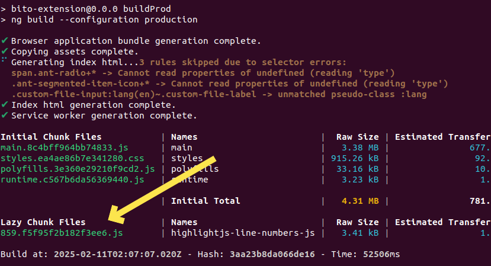

# Build Process For BITO as a VSCODE Extension

## Overview

This document explains the functionality and execution process of the `build.sh` script in the custom VSCode extension.

The script is designed to support CI/CD pipelines by managing the build process, ensuring the correct environment settings, handling dependencies, and generating necessary artifacts for deployment.

#### **Jenkins Build Process**

The Jenkins build process automates the creation of binaries for different build environments.

Below is how Jenkins handles different branch builds:

#### **Release Branch Builds (`release_vscode/x.x.x`)**

- Triggers the build process to generate both **Preproduction** and **Production** binaries.
- The resulting binaries are shared in the **#builds-sharing** Slack channel.
- The binaries follow the naming convention:
   - **Preprod:** `BITO-x.x.x-preprod.vsix`
   - **Production:** `BITO-x.x.x.vsix`
- The build artifacts are uploaded to **S3 (arn:aws:s3:::bito-builds)**.
- **Authwidget version is updated** based on preproduction and production.
- Once the release branch is built, a **Git tag** is automatically created: `x.x.x-vscode` (where `x.x.x` is the version from `vscode/package.json`).

#### **Feature Branch Builds (Any branch other than `release_vscode/x.x.x`)**

- Generates a **Staging** build.
- The resulting binary is shared in the **#builds-sharing** Slack channel.
- The binary follows the naming convention:
   - **Staging:** `BITO-x.x.x-BRANCH-<BRANCH_NAME>-SNAPSHOT.vsix`
- The build artifact is uploaded to **Nexus**: [Nexus Builds](http://nexus.bito.ops:8083/#browse/browse:bito-builds).

#### **Branch Creation Guidelines**

- For every new release, a **`release_vscode/x.x.x` branch** must be created.
- After the release, it should be **merged into `development_vscode`**.
- The version number for the new `release_vscode/x.x.x` branch should be **one version ahead** of the current release.
- Once the `release_vscode/x.x.x` branch is created, **GitLab CI will automatically update** the version in `vscode/package.json` based on the `x.x.x` value in the branch name.

## Webpack Configuration Role in the Build Process

A detailed explanation of how `webpack.config.js` influences the build process for the VSCode installer is available in the Confluence document.

This document provides insights into:

- How Webpack processes dependencies and bundles assets.
- The role of `WEBPACK_MODE` in different build environments `(staging, preproduction, production)`.
- How Webpack outputs the final VSCode extension package.
- Optimization strategies and performance tuning specific to Webpack.

For a deeper understanding, refer to the [Confluence document](https://bito.atlassian.net/wiki/x/AoBVLg) that outlines the Webpack setup and its integration with the CI/CD pipeline.

## Important Prerequisite

Before running the build process, ensure that **VPN login is set up (contact DevOps Team)** to download dependencies from the custom [Nexus repository](http://nexus.bito.ops:8083/repository/bito-builds-npm/)

This is essential for fetching:
- The `@bito/authwidget` dependency in `ide-plugins/ui-code/package.json`.
- The `Spectre` dependency for BITO as a VSCode extension in `ide-plugins/vscode/package.json`.

## Check your Nexus Login (through command-line)

```sh
npm login --registry=http://nexus.bito.ops:8083/repository/bito-builds-npm/
```
Enter username and password on prompt.

Contact DevOps Team for credentials when below doesn't work

```sh

username: developer
password: 2js20TNmknFd
email: devops@bito.ai

```

## Purpose of `build.sh`

- Sets up the required environment variables.
- Reads package metadata from `package.json` using `jq` or Node.js.
- Handles `@bito/authwidget` versioning dynamically for preproduction and production builds.
- Manages dependencies by installing required `npm` packages.
- Executes Webpack build based on the `WEBPACK_MODE` environment variable.
- Cleans previous build artifacts before starting a new build.
- Builds the UI code (`ui-code`) for different environments (`staging`, `preproduction`, `production`).
- Copies generated assets to the appropriate distribution folders.
- Packages the VSCode extension into a `.vsix` installer for distribution.

## Execution Instructions

To run the `build.sh` script, use the following command in the terminal:

```sh
chmod +x build.sh  # Ensure the script has execution permissions
./build.sh <staging | production>
```

### Example Usage:

- **Staging Build:**
  ```sh
  ./build.sh staging
  ```
- **Production Build:**
  ```sh
  ./build.sh production
  ```

## How It Works

1. **Reads the `package.json` file** to extract `name` and `version` dynamically.

2. **Handles dependency management**:
   - Updates `@bito/authwidget` version based on preproduction or production build.
   - Installs necessary `npm` packages in `ui-code` and VSCode extension.

3. **Executes UI Build**:
   - Runs `npm run build` for `staging`.
   - Runs `npm run buildPreProd` for `preproduction`.
   - Runs `npm run buildProd` for `production`.

4. **Updates Webpack configuration**:
   - Sets `WEBPACK_MODE` dynamically based on the build type.

5. **Copies build artifacts**:
   - Moves `ui-code/dist` contents to `vscode/dist/bito-ui`.
   - Copies additional `assets` for the VSCode module.

6. **Builds and packages the VSCode extension**:
   - Bundles the extension using Webpack.
   - Creates the `.vsix` installer package.

7. **Handles cleanups and reverts package modifications** after the build process.

## Handling Production Build with Preproduction Step

- The script follows a two-step build for `production`:
  1. **First, it creates a `preproduction` build.**
  2. **Then, it builds the final `production` version.**
  
This ensures that any dependencies or chunk files are properly updated before generating the production package.

## Important Points to Remember During Production Build

### **Monitor the Build Console Output**

- During the UI build (`ng build` or equivalent), watch the terminal/logs for new chunk file names.
- Look for file names that match the ones in `application.properties`, as these might be dynamically generated.

### **Identify Changes**

- If the generated chunk file names in the build output differ from those in `application.properties`, update the file accordingly.

### **Manually Update `application.properties`**
- Modify the values in the `[staging]` or `[prod]` sections with the new chunk file names from the build logs.

### **Rerun the Build Process**
- After updating `application.properties`, restart the build to ensure the correct chunk files are used.



## Troubleshooting

- If the build fails, check the console logs for errors related to dependencies, file access, or missing configurations.
- Ensure `jq` is installed if package information extraction fails.
- If chunk files change, update `application.properties` accordingly and rerun the build.

## Additional Notes

- This script is designed to support CI/CD pipelines.
- Run this script before publishing a new release.
- Automating chunk file updates could improve efficiency and reduce manual intervention.

## License ##

Copyright (C) 2021, Bito Inc - All Rights Reserved

[Scroll to top](#build-process-for-bito-as-a-vscode-extension)

