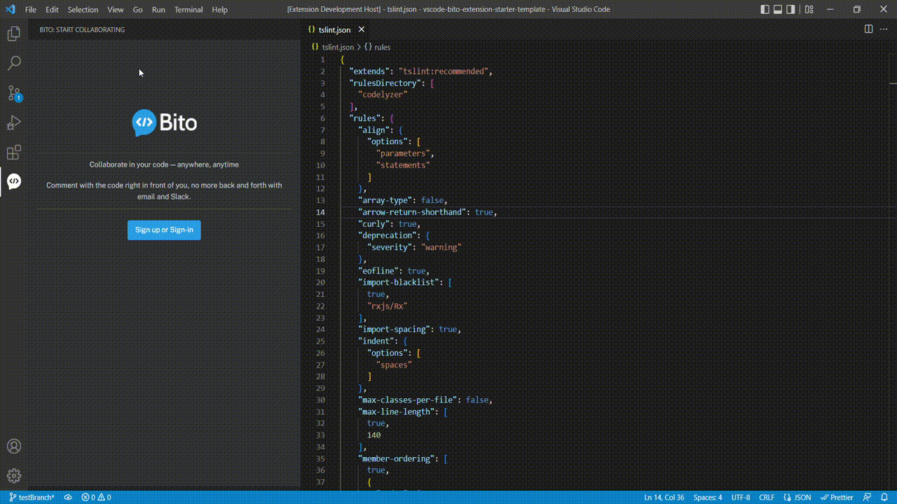
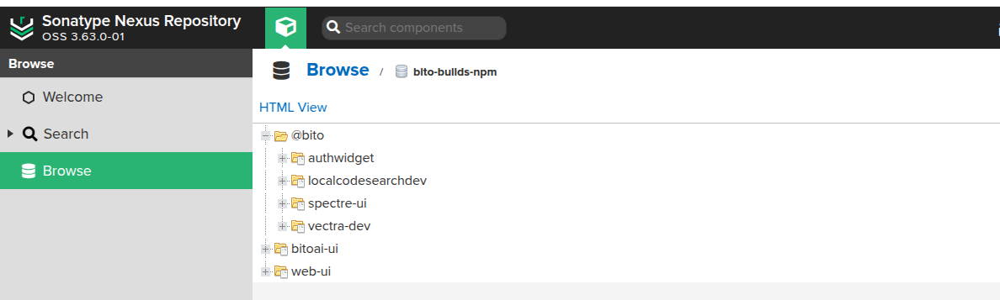
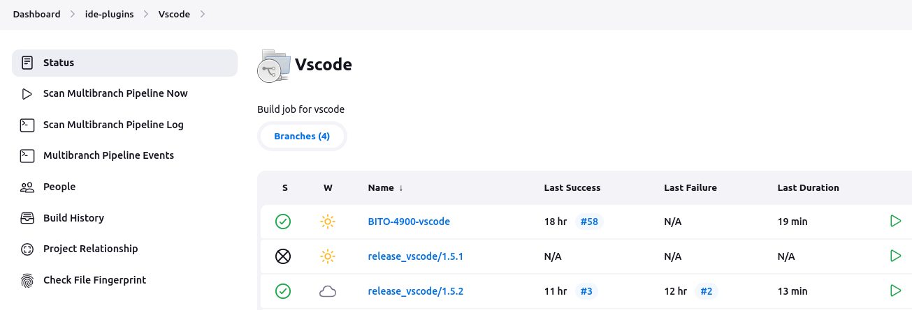
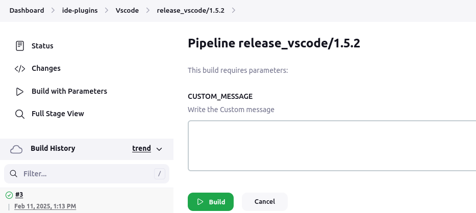
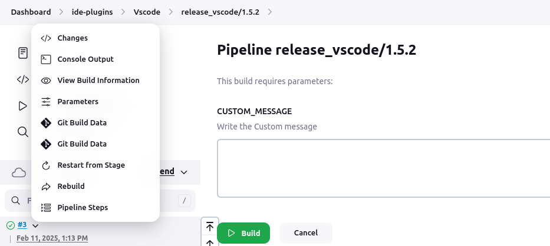
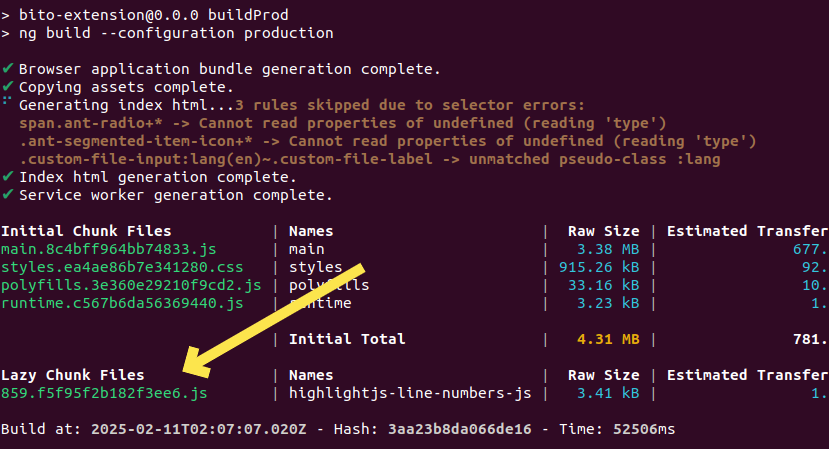
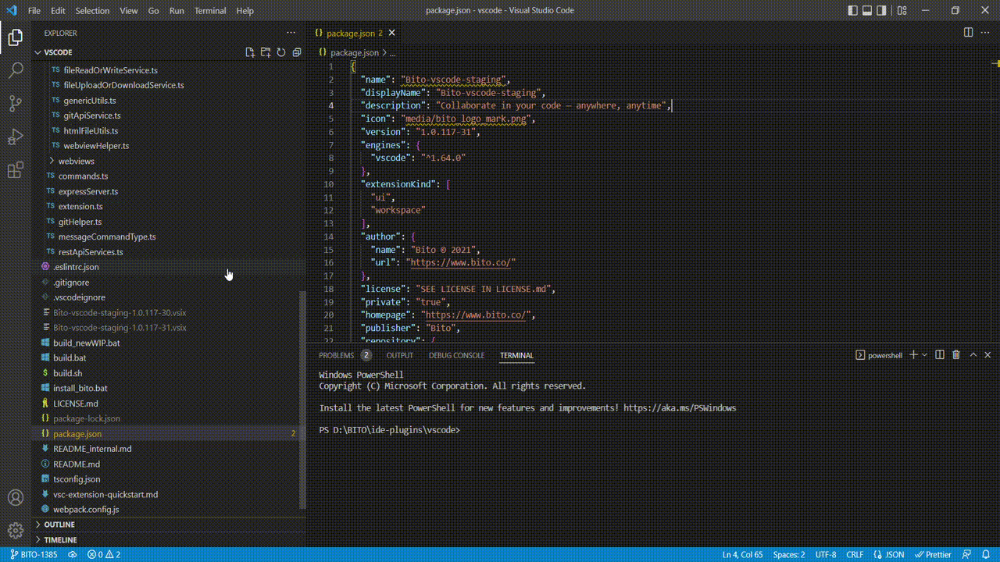

# **BITO as VS Code Extension**



[**Pick Me For Home Page**](../README.md)

## **Documentation and Resources**
For detailed documentation and additional resources related to the BITO VS Code extension, visit the official Confluence page:

[BITO VS Code Extension - Documentation](https://bito.atlassian.net/wiki/x/DYAfEw).

For more details, refer to the [Project Build README](docs/build-process.md) to understand:

- Project specific NPM configuration.[Project Specific NPM setup](docs/npmrc-setup.md)
- Jenkins build process through CI / CD pipelines.
- GIT branch creation guidelines for development work.
- Webpack configuration role in the build process.
- How build script works to create VSCODE IDE installer (*.vsix).

## <ins>Build Extension</ins>

### Prerequisite

Before running the build process, ensure that **VPN login is set up (contact DevOps Team)** to download dependencies from the custom [Nexus repository](http://nexus.bito.ops:8083/repository/bito-builds-npm/).

This is essential for fetching:

- The `@bito/authwidget` dependency in `ide-plugins/ui-code/package.json`.
- The `Spectre` dependency for BITO as a VSCode extension in `ide-plugins/vscode/package.json`.

## Check your Nexus Login (through command-line)

```sh
npm login --registry=http://nexus.bito.ops:8083/repository/bito-builds-npm/
```

Enter username and password on prompt.

Contact DevOps Team for credentials when below doesn't work:

```sh
username: developer
password: 2js20TNmknFd
email: devops@bito.ai
```


### **Quick Build with Shell Script**

#### **How to create the Staging build locally**

- Open your terminal.
- Navigate to `<your-project-directory>/ide-plugins/vscode`.
- Run the build script with the staging environment:

```sh
./build.sh staging
```

This will generate a staging build locally for testing and development purposes.

#### **How to create the Preprod and Production builds locally**

- Open your terminal.
- Navigate to `<your-project-directory>/ide-plugins/vscode`.
- Run the build script with the production environment:

```sh
./build.sh production
```

- The script follows a two-step build for `production`:
  1. **First, it creates a `preproduction` build.**
  2. **Then, it builds the final `production` version.**

### **Locate BITO VSCode Extension Installer**

- Navigate to `ide-plugins\vscode\`
- Install the generated build (\*.vsix) in VSCode IDE.

### **Quick Build with CI/CD Integration**

For automated builds using Jenkins, follow these steps:

1. Take **VPN connection** to connect to BITO's operations environment.Contact DevOps team for any support.

2. Open a browser and navigate to the [Jenkins URL](http://jenkins.bito.ops:8080/job/ide-plugins/job/Vscode/) provided by the DevOps team.

3. Log in with your Jenkins credentials. If you don't have access, contact the DevOps team.

4. Locate the appropriate Jenkins job / GIT Branch for BITO VSCode extension.


5. Click on **Build with Parameters**, provide any custom message. Click on **Build** to trigger the pipeline.

6. The custom message will be pushed to `Slack` along with attached environemnt specific *.vsix.


7. Monitor the console logs to ensure the build completes successfully.


8. Once the build is complete, you can download the `.vsix` file for installation.

## **Things to Remember While Creating Production Build**

### **Check for Build Failures**

⚠ **Ensure there are no build failures or errors** before proceeding. Fix any issues and rerun the build script.

### **Verify Lazy Chunk File Versions**

- During the build process, keep track of the generated lazy chunk files.
- Compare these versions with the ones listed in `vscode/assets/config/application.properties` under `[Prod]`.
- If there is a mismatch, update the file with the new versions.
- Once the changes are made, rerun the build script to load chunk files with correct version on extension activation in IDE.



---

### ** How to Install the VSCode Extension (`.vsix` file) **

#### Option 1: Install from VS Code UI

1. Open VSCode.
2. Click **Extensions** (Sidebar).
3. Click the three-dot menu → **Install from VSIX...**.
4. Select the generated `.vsix` file.

#### Option 2: Using Command Palette

1. Press `Ctrl+Shift+P`
2. Type **Install from VSIX**
3. Select the generated `.vsix` file.
4. Restart VSCode.



---

## License

© 2021 Bito Inc - All Rights Reserved.

[🔝 Scroll to top](#bito-as-vs-code-extension)
